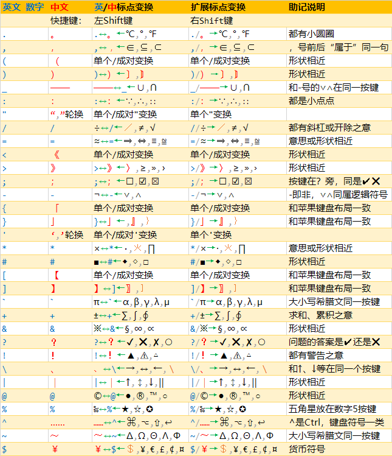
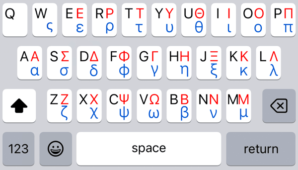

# *FinalD / 终点 🏁*
*2026年5月28日*

## 摘要
🚨 **因AutoHotkey有重大改动，此插件程序v7.69.192版及之后的版本只能在AutoHotkey v2.0.26版及之后的版本中运行！v7.68.190及之前的版本只能在AutoHotkey v2.0.11 ~ v2.0.19版中运行！**

ℹ️提示：可通过此文档右上角的【标题列表】按钮快速转到某个标题。可通过后面有“⚡️”图标的标题内容快速了解此项目，以及留意各部分的**粗体字**内容。有“✨”图标的内容为新版本相较上一个版本的新增或改动之处

| 脚本名称              | 最新版本                                                     | 说明                |
| --------------------- | ------------------------------------------------------------ | --------------------- |
| FinalD.ahk            | [v7.68.190](https://github.com/Lantaio/IME-booster-FinalD/archive/refs/tags/v7.68.190.zip)（*2026/5/11*） | 主程序                |
| MySettings\AppGroup.ahk | v2.5 (*2026/5/11*)                                             | 用户设置\自定义程序组 |
| MySettings\Shortcut.ahk | v6.10 (*2026/5/11*)                                           | 用户设置\自定义快捷键 |

（*运行程序后用[快捷键](#快捷键速查表) 左<kbd>Win</kbd>+<kbd>Alt</kbd>+<kbd>.</kbd>查看版本信息和各项功能的开关状态信息。*）

### 更新摘要：

| 日期        | 版本号    | 更新内容                                                     |
| ----------- | --------- | ------------------------------------------------------------ |
| 2024/6/16   | v1.32.66  | 🎊输入标点符号时根据前一个字符的中/英文属性来上屏相应的标点，以及[标点符号漂移](#标点符号漂移)功能 |
| 2024/8/18   | v2.36.75  | 🎊增加[全键盘漂移](#全键盘漂移)功能                           |
| 2024/11/5   | v4.42.92  | 🎊增加[中文语境软件优化](#中文语境软件优化)功能               |
| 2024/12/16  | v5.45.101 | 🎊增加[(表格)兼容模式](#兼容模式)功能                         |
| 2025/1/18   | v5.50.116 | 🎊增加[大小写转换](#大小写转换)功能                           |
| 2025/2/8    | v5.55.133 | 🎊增加**长按打开Rime候选窗口**功能（已被v7.x版中的**魔幻长按**功能包含）和[配对标点输入改进](#配对标点输入改进) |
| 2025/12/28✨ | v6.61.156 | 🎊将用户自定义设置提取出来放在MySettings文件夹，方便日后升级时保留自定义设置（ℹ️由于此项目不再是单文件项目，安装方法有变动，详见[安装步骤](#安装步骤%EF%B8%8F)）；🐣️增加[中文标点提示](#中文标点提示)功能；🐣️在有自动配对标点功能的应用程序中禁用英文标点自动配对功能； |
| 2026/4/26✨  | v7.68.189 | 🎊增加[魔幻长按](#魔幻长按)功能；🐣️增加[字母方向键](#字母方向键)功能。 |

详细更新信息见[更新日志](joy/ChangeLog.md)。

## 项目缘起⚡️
如果你是程序员，那么很可能和我有同样的遭遇，就是用着一个号称中英混输的输入法，却还是经常需要切换中/英输入模式。为啥？原来是为了输入标点符号。而且经常因为忘记切换，导致按对按键却输错标点。或者想输入中文却发现直接上屏了英文，而要狂按<kbd>Backspace</kbd>键来改错，非常无语。

这个输入法插件（以下简称此插件）的初衷就是要走完这最后的一公里，希望通过上下文来智能输入中/英标点符号，并且可以用<kbd>Shift</kbd>键快速变换。<mark>无需切换中/英输入模式，**实现更智能化、更人性化和更高效地输入标点符号的目的**，将所有中文输入法带进真正意义上的中英混输新纪元。</mark>

✔谁需要这个输入法插件（忽悠对象）：
* **经常需要切换中/英输入模式**又想早睡的程序员；
* **经常需要输入键盘上没有键位的中/英标点符号**的科研人员，或者是写学术论文的师生，例如：℃、π、≌、『』、²、⌘等；
* 在码字时**经常要按**<kbd>Backspace</kbd>**键来改错**的忍士；
* 喜欢**用Markdown写作和做笔记**的次世代人类。

❌谁不需要这个输入法插件：
* 不需要用电脑的人；
* 只用电脑写单一语言文档的人。

## 主要功能⚡️
1. 基础功能是**输入标点符号时根据前一个字符是中文或是英文（包括数字）来上屏相应的标点符号，并且成对的标点符号在特定情况下会自动配对**，主打简单粗暴式智能。
2. 如果想在英文和数字后输入中文标点，可以通过[魔幻长按](#魔幻长按)功能实现，或者通过下面的[标点符号漂移](#标点符号漂移)功能实现。
3. 如果想在中文后输入英文标点，可以通过下面的“标点符号漂移”功能，在输入中文标点之后再按 左<kbd>Shift</kbd>键实现。

### 魔幻长按✨
从v7.65版开始长按标点键的功能优化如下：在本来会输入英文标点的情况下，长按标点键0.2秒，会直接输出中文标点（Rime输入法会弹出你设定的候选窗口，并可触发你设定的功能）；长按超过0.4秒时，在中文后重复输出中文标点，在英文或数字后会删除之前输入的中文标点，转而重复输出英文标点。

例如：如果想在英文或数字后输入中文句号，除了通过之前的漂移方法，按<kbd>.</kbd>键后再按 左<kbd>Shift</kbd>键 变换之外，还可以通过长按<kbd>.</kbd>键0.2秒1次搞定。✌

下面是在不同情况下按<kbd>.</kbd>键的输入情况：

| 按键方式      | 英文后               | 数字后            | 中文后                  |
| ------------- | -------------------- | ----------------- | ----------------------- |
| 短按          | text<mark>.</mark>   | 2<mark>.</mark>   | 文本<mark>。</mark>     |
| 长按0.2秒     | text<mark>。</mark>  | 2<mark>。</mark>  | 文本<mark>。</mark>     |
| 长按超过0.4秒 | text<mark>...</mark> | 2<mark>...</mark> | 文本<mark>。。。</mark> |

### 标点符号漂移

在说明怎么个漂移之前，得先上一张设计方案图，有了它再来忽悠就容易得多了。

呃……事情没有你想的那么复杂，你听我狡辩。
* 上图第三列“英/中标点变换”的意思是当光标在标点符号后面时，**按 左<kbd>Shift</kbd>键会将光标前的标点符号在`↔`号两边的常用中/英标点间来回变换**。另外，当光标在成对的标点符号中间时，此功能键还可以快速变换成对的标点符号。例如：成对的`""`和`“”`互相变换，英文`[]`和中文`【】`互相变换，等。 \
  左<kbd>Shift</kbd>键还有一个功能，就是当光标前的标点是`←`号右边的扩展标点符号时，按此功能键可快速变换为`←`左边的常用标点。
* 上图第四列“扩展标点变换”的意思是当光标在标点符号后面时，**按 右<kbd>Shift</kbd>键可将`→`左边所列的常用中/英标点快速变换为`→`右边的扩展标点符号**。另外，当光标在成对的标点符号中间时，此功能键同样可以自动变换成对的标点符号。右<kbd>Shift</kbd>键还有一个区别于 左<kbd>Shift</kbd>键的功能，就是在对`'`或`"`变换时，只对光标前的标点进行单个变换，而不会对成对的`''`或`""`进行变换，在某些情况下会用到。
* **数字后按<kbd>.</kbd>、<kbd>:</kbd>和<kbd>~</kbd>键默认输入英文标点**。啥，数字后想输入中文标点？按照主要功能中第2点所说的，长按标点键0.2秒。如果手速快短按了也问题不大，只需要在输入英文标点之后按一下 左<kbd>Shift</kbd>键进行变换。另外，一般的中文输入法在你想输入6.5而不小心输入了67时，当你按<kbd>Backspace</kbd>键后再按<kbd>.</kbd>键想上屏小数点，却一般会上屏中文“。”号。也就是说你得再删除一个没有输错的数字，再输一遍才行，是不是很不爽？此插件无论任何时候，只要光标前面是数字，按<kbd>.</kbd>键默认上屏小数点。
* 为Markdown写作做了考虑与优化。

肿么样，看完上面复杂的解释，再来看这张设计图，是不是很简单？😜

### 配对标点输入改进
在手动输入配对标点时（非自动配对），**短按后标点键光标会自动回到配对标点中间**。因此无论在任何地方，如果打算输入成对的标点并且在其中输入内容的话，建议你先输入成对的标点，因为这样可以避免由于前后输入的内容的中英属性不同，而导致前后配对标点不同。相对的，**长按后标点键光标*不会*回到配对标点中间**。

另外，按<kbd>Alt</kbd>+<kbd>Del</kbd>剪切光标后1个字符，用于过度自动配对标点的后续操作。相应的，<kbd>Alt</kbd>+<kbd>Backspace</kbd>剪切光标前1个字符。

### 大小写转换
你是否经常遇到这种情况，就是你按了<kbd>CapsLock</kbd>键切换到大写状态输入了一些大写英文，然后忘记了处于大写状态，在想输入拼音或者五笔的时候发现上屏了几个大写英文字母。以前我只能狂按<kbd>Backspace</kbd>键，然后按一下<kbd>CapsLock</kbd>键切换回小写状态，再输一遍刚按过的几个字母按键。手速越快越崩溃。从v5.50版开始，此程序加入了几个大小写转换功能，目的是码字时不用在意<kbd>CapsLock</kbd>的状态（下表的示例中光标在最后）：

（ℹ*必须按照先后顺序按下快捷键*）

| 大写状态 | 快捷键                                 | 转换前       | 转换后                                           | 转换后的大写状态 | 功能说明                                                     |
| -------- | -------------------------------------- | ------------ | ------------------------------------------------ | ---------------- | ------------------------------------------------------------ |
| 关闭     | 左<kbd>Shift</kbd>+<kbd>CapsLock</kbd> | Some文本text | Some文本<mark>TEXT</mark>                        | 关闭             | 只转换光标前1个英文片段为**全部大写**。                      |
| 关闭     | 右<kbd>Shift</kbd>+<kbd>CapsLock</kbd> | Some文本text | Some文本<mark>Text</mark>                        | 关闭             | 只转换光标前1个英文片段为**首字母大写**。                    |
| 开启     | 左<kbd>Shift</kbd>+<kbd>CapsLock</kbd> | Some文本TEXT | Some文本<mark>text</mark>                        | 关闭             | 只转换光标前1个英文片段为**全部小写**。                      |
| 开启     | 右<kbd>Shift</kbd>+<kbd>CapsLock</kbd> | Some文本TEXT | Some文本（另将text发送给中文输入法，出现候选框） | 关闭             | 只删除光标前1个英文片段，并将其小写形式**发送给中文输入法**。 |

补充说明：光标前的英文大小写形式并不重要，漂移功能只与大小写状态有关。例如：光标前是“Text”，大小写状态处于关闭状态时，按 左<kbd>Shift</kbd>+<kbd>CapsLock</kbd>照样会将光标前的“Text”转换为“TEXT”。

助记：左<kbd>Shift</kbd>+<kbd>CapsLock</kbd>是转换为全大写或者全小写，而 右<kbd>Shift</kbd>+<kbd>CapsLock</kbd>是更特别的转换功能。

## 扩展功能⚡️
### 全键盘漂移✨
此插件从v2.x版开始加入英文字母和数字的漂移功能（v7.x版改变了变换快捷键）。当光标在大、小写英文字母后面时，按 左<kbd>Win</kbd>+右<kbd>Shift</kbd>键可以将光标前面的英文字母变换为对应的大、小写希腊字母。反之，当光标在大、小写希腊字母后面时，按  左<kbd>Win</kbd>+左<kbd>Shift</kbd>键可以将光标前的希腊字母变换为对应的大、小写英文字母。英文字母和希腊字母的对应关系见下图（黑色为英文字母键位，红色为大写希腊字母，蓝色为小写希腊字母）：

另外，当光标在数字0~9后面时，按 左<kbd>Win</kbd>+左<kbd>Shift</kbd>键会变换为对应的下、上标数字和空心数字序号，按 左<kbd>Win</kbd>+右<kbd>Shift</kbd>键则会变换为对应的大、小写罗马数字和实心数字序号，下图以数字2为例：

### 中文语境软件优化
比方便快捷地变换标点符号更爽的是什么？是一击即中！换言之就是力求让此插件“懂”你想输入什么标点符号。以前此插件在全部应用程序上的体验都是一致的，例如：在英文之后输入标点符号会上屏英文标点。在编程软件中这样处理是合适的。但当我们用QQ或者微信撩妹的时候，即便其中夹杂着英文，可能多数时候希望输入的是中文标点符号。因此从v4.x版开始引入“中文语境应用程序组”概念，你可以将以中文输入为主的应用程序加入到此程序组中。

在MySettings\AppGroup.ahk的`GroupAdd "CN"`部分，有些预设项，可按需删除或临时注释掉不想以中文标点为主的预设项，也可以添加你希望以中文标点为主的应用程序。附`GroupAdd`用法[帮助文档](https://wyagd001.github.io/v2/docs/lib/GroupAdd.htm)和[正则表达式快速参考](https://wyagd001.github.io/v2/docs/misc/RegEx-QuickRef.htm)。

**默认状态：开启**。如果不想默认打开此功能，可将MySettings\Shortcut.ahk开头处的`global BetterCN := true`中的`true`修改为`false`即可。关闭此功能代表在所有支持的应用程序中都是一致的输入体验。

**快捷键：右<kbd>Shift</kbd>+左<kbd>Win</kbd>** 开/关此功能。

### 兼容模式
在v5.x版之前此插件不能在各种软件的表格中使用，在表格中输入之前须要停用此插件。

从v5.x版开始加入兼容模式功能，此模式其实是关闭了智能中/英标点输入和自动配对功能，保留用<kbd>Shift</kbd>键变换标点功能，使得切换到该模式时，在各种软件的表格中可以正常输入和变换标点。

**默认状态：关闭**。默认为智能模式。

**快捷键：左<kbd>Ctrl</kbd>+左<kbd>Win</kbd>** 开/关此功能。

### 字母方向键✨
从v7.67版开始加入此功能，长按（0.2秒）<kbd>i</kbd>、<kbd>k</kbd>、<kbd>j</kbd>和<kbd>l</kbd>键相当于按1次<kbd>↑</kbd>
、<kbd>↓</kbd>、<kbd>←</kbd>和<kbd>→</kbd>，一直按着这些键会连续移动光标；长按<kbd>Shift</kbd>+<kbd>i</kbd>、<kbd>k</kbd>、<kbd>j</kbd>和<kbd>l</kbd>键相当于按<kbd>Ctrl</kbd>+<kbd>Home</kbd>（滚动到页首）
、<kbd>Ctrl</kbd>+<kbd>End</kbd>（滚动到页尾）、<kbd>Home</kbd>和<kbd>End</kbd>；长按<kbd>u</kbd>、<kbd>o</kbd>键相当于按<kbd>Esc</kbd>、<kbd>Delete</kbd>

**默认状态：开启**。⚠注意此时不能通过长按这些字母键来连续输入这些字母，因为会变成连续移动光标。

**快捷键：左<kbd>Shift</kbd>+左<kbd>Win</kbd>** 开/关此功能。

### 中文标点提示
从v5.59版加入此功能，在输入“()”、“'”和“"”等容易混淆的中/英文标点时，在输入中文标点时有提示信息，而在输入英文标点时没有提示信息，以示区别。

**默认状态：关闭**。因为此功能对性能有些影响。

**快捷键：右<kbd>Ctrl</kbd>+左<kbd>Win</kbd>** 开/关此功能。在不容易区分中英文标点的应用程序中可开启此功能。

## 安装需求
* 由于此插件是基于AutoHotkey这个开源软件而编写的脚本程序，而它只支持Windows系统，所以**此插件暂时只能在Windows系统使用**。
* AutoHotkey这个神器占用磁盘空间不足10MB,而且在你不运行脚本的时候不会运行占用内存。此插件运行时只占用2MB左右内存，而且CPU占用率极低，长期为0%。此插件只会在运行时接管所有标点符号按键事件，并且可以随时停用或关闭，**不会对你所用的输入法和电脑系统有任何改动**。
* 此输入法插件理论上适用于所有中文输入法。

## 安装步骤⚡️
### 首次安装✨
1. **安装依赖软件**：如果未安装AutoHotkey，先去[下载](https://www.autohotkey.com/)并安装（只能安装2.0.19版）。

2. **下载此项目**：下载最新版的[Zip压缩包](https://github.com/Lantaio/IME-booster-FinalD/tags)，只需解压其中的Win文件夹，主程序是Win\FinalD.ahk。⚠注意：*首次安装*须要将Win文件夹中的Settings文件夹改名为MySettings，否则程序不能运行！这样做的目的是在Settings文件夹中存放的是用户自定义设置的样板文件，而MySettings文件夹中存放的才是用户自定义设置文件，这样在日后更新升级时就不会覆盖用户自定义设置。

3. **此插件需要识别你所用的输入法**，已设置识别下面列出的输入法：

	* Rime输入法
	* 微软拼音、五笔输入法
	* 搜狗拼音、五笔输入法
	* QQ拼音、五笔输入法
	* 手心输入法
	* 百度拼音

	如果你用的输入法在上面的列表中，无需做第4步，直接做第5步。

4. 如果你所用的输入法不在第3步的列表中，可以**通过『Window Spy』获取输入法的`ahk_class`值**，步骤如下：
	1. 在『文件资源管理器』中点击（或双击）Win\FinalD.ahk 运行它。
	2. 然后在电脑屏幕右下角任务栏处会有个绿色的H图标，在此图标上点击鼠标右键，在右键菜单中点击「Window Spy」打开『Window Spy for AHKv2』窗口。
	3. 用代码编辑器或者记事本打开Win\MySettings\AppGroup.ahk文件。
	4. 按`a`键，待出现输入法候选框之后，鼠标移动到输入法候选框上，然后查看在第2步打开的『Window Spy』窗口，找到并复制第2行“ahk_class ...”的内容。
	5. 回到AppGroup.ahk文件，找到`GroupAdd "IME"`部分，用上一步复制的“ahk_class ...”添加一行`GroupAdd "IME" "ahk_class ..."`，保存程序并关闭编辑器。
	6. 最后，在电脑右下角的绿色H图标上点击鼠标右键，在右键菜单中点击「Exit」。

5. 须要在输入法设置中**禁用通过<kbd>Shift</kbd>键切换中/英输入模式**，建议设置为“无”，这样还是可以通过<kbd>Ctrl</kbd>+<kbd>Space</kbd>来切换中/英输入模式的。

6. 须要**关闭Office Word的“使用智能段落选择”功能**。具体步骤是打开Word，依次点击「文件」菜单→左下角「选项」→在打开的『Word选项』窗口中选择左边中间的「高级」→右边「编辑选项」中取消勾选“使用智能段落选择”。如需了解具体原因，看此[议题](https://github.com/Lantaio/IME-booster-FinalD/issues/20)。

7. 点击（或双击）**运行 FinalD.ahk 脚本程序**。🎉🎉🎉乌拉!感受火箭🚀️升空般的推背感吧！😎

### 后续升级✨
1. **下载此项目**：下载最新版的[Zip压缩包](https://github.com/Lantaio/IME-booster-FinalD/tags)，只需解压其中的Win文件夹到你之前存放Win文件夹的地方，覆盖所有文件。\
🚨**警告：如果你自己修改过FinalD.ahk文件，则不能直接覆盖，否则会丢失你的代码**！如需保留你的自定制设置，需要在代码编辑器中比较两个文件，将更改合并到你的文件中。

2. 比较Win\Settings文件夹和Win\MySettings文件夹，将Settings文件夹中新增加的文件*移动*到MySettings文件夹。

3. 比较Win\Settings文件夹和Win\MySettings文件夹都有的文件，查看其版本号，如果版本号相同则表示没有更改。\
如果比MySettings文件夹中的同名文件的版本号更新，表明有更新或改动。根据文件开头的“重大更新说明”中的说明将更改合并到MySettings文件夹中的文件。最后不要忘了更新文件的版本号为新的版本号。

## 快捷键速查表
（ℹ*必须按照先后顺序按下快捷键*）

| 快捷键                              | 功能说明                                 |
| ----------------------------------- | -------------------------------------- |
| 左<kbd>Win</kbd>+<kbd>.</kbd> | 启用/停用 此插件程序（总开关）。 |
| 左<kbd>Win</kbd>+<kbd>Alt</kbd>+<kbd>.</kbd> | 显示此程序的版本信息以及各项功能的状态信息。 |
| 左<kbd>Shift</kbd>+左<kbd>Win</kbd> | 开/关 [字母方向键](#字母方向键)功能（包括字母和数字）。 |
| 右<kbd>Shift</kbd>+左<kbd>Win</kbd> | 开/关 [中文语境软件优化](#中文语境软件优化)功能。 |
| 左<kbd>Ctrl</kbd>+左<kbd>Win</kbd>  | 开/关 （表格）[兼容模式](#兼容模式)（即 关/开 智能中/英标点输入和自动配对功能）。 |
| 右<kbd>Ctrl</kbd>+左<kbd>Win</kbd> | 开/关 [中文标点提示](#中文标点提示)功能。 |
| 左<kbd>Win</kbd>+左<kbd>Shift</kbd> | 将光标前的希腊字母变换为相应的英文字母；将罗马数字变换为相应数字或上下标数字 |
| 左<kbd>Win</kbd>+右<kbd>Shift</kbd> | 将光标前的英文字母变换为相应的希腊字母；将数字变换为相应罗马数字 |

## 已知问题⚡️
* 暂时只支持Win系统，**不支持Mac和Linux**。
* 🚨**在输入密码时可能会有问题，导致输入的密码不正确**！暂时无法解决，只能在输入密码之前通过快捷键 左<kbd>Win</kbd>+<kbd>.</kbd>停用此插件。
* ⚠**不支持CMD命令提示符**，但支持PowerShell。（此程序已自动识别，使用CMD时无须停用此插件。）
* ⚠**在Excel中不能使用智能标点输入和自动配对功能**,但支持Excel的VBA编辑器。（此程序已自动识别，使用Excel时*无须*手动打开（表格）[兼容模式](#兼容模式)。）
* ⚠**在各种软件的表格中不能使用智能中/英标点输入和自动配对功能**，因问题比较复杂，暂时无法解决，只能通过快捷键 左<kbd>Ctrl</kbd>+左<kbd>Win</kbd>开启（表格）[兼容模式](#兼容模式)。
* 如果在使用此插件的过程中**出现输入不正常的情况**（不单止是输入标点符号），这多数是由于你正在运行比较占用CPU的应用程序，导致没有正确释放<kbd>Shift</kbd>键导致的。解决办法是分别按一下 左、右<kbd>Shift</kbd>键，应该就可以恢复正常。如果经常发生此问题，则要么关闭严重占用CPU的应用程序，要么尝试在『控制面板』→『电源选项』中将电源计划设置为「高性能」。
* 在Word和PowerPoint中，输入英文单、双引号会自动变换为中文单、双引号。这个问题不是此插件造成的，是Office画蛇添足的骚操作，有[解决办法](https://github.com/Lantaio/IME-booster-FinalD/issues/4)。
* 不能在选择了内容的情况下输入标点符号，会出现非预期的结果。但在Obsidian和Sublime Text中编辑Markdown时，可以选择内容后按<kbd>\*</kbd>键或<kbd>\`</kbd>键等来设置格式。
* 输入标点符号时由于是通过选择光标前、后字符来决定上屏哪个标点，因此可能会出现短暂闪动，Word等反应慢的程序会更加明显，但我觉得相比起所实现的功能来说，这种不适可以接受。暂时无法解决，如果你对这种闪动感到严重不适，只能弃用此插件。

## 后续操作
* 如果你在使用某些有自动配对标点功能的编程软件时遇到问题，则需要将其添加到Win\MySettings\AppGroup.ahk文件中的“AutoPair”程序组，具体做法类似于[安装步骤](#安装步骤%EF%B8%8F)中的4.ⅴ步。
* 如果你想将此插件**添加为开机启动项**，可以到AI网站[Kimi](https://www.kimi.com/)向它提问：“如何将AutoHotkey脚本添加为开机启动项？”
* 如果在某些情况下你需要**临时停用此插件**的话，无须关闭退出此程序，只需按快捷键 左<kbd>Win</kbd>+<kbd>.</kbd>即可。留意任务栏绿色H图标会有变化。当你想恢复启用此插件时再次按此快捷键即可。（注意：这相当于在任务栏的H图标上点击鼠标右键，在右键菜单中选择「Suspend Hotkeys」，而不是选择「Pause Script」。）
* 此脚本程序只是一个样板，你完全可以按你的想法来改造这个脚本程序，使其真正成为你码字的🚀推进器。在最后的“[致谢](#致谢)”中有AutoHotkey中文帮助链接地址。
* 如果你对自定制输入法有更高的要求，那我推荐你入坑Rime输入法。有兴趣的话可以瞧瞧我的Rime输入法项目[惊喜输入方案](https://github.com/Lantaio/Rime-schema-JoySchema)。

## 欢迎反馈
* 如果你在使用此插件的过程中发现有什么问题、缺陷或功能需求，请在[议题（Issues）](https://github.com/Lantaio/IME-booster-FinalD/issues)中反馈情况。
* 如果有任何疑问或建议可在[讨论区（Discussions）](https://github.com/Lantaio/IME-booster-FinalD/discussions)中提出。

## 卸载步骤
如果你不喜欢使用此插件，可以通过下面几个简单的步骤来删除它：
1. 用鼠标右键点击电脑右下角任务栏的绿色H图标，在右键菜单中点击「Exit」关闭此插件。
2. 打开系统的『文件资源管理器』，找到此插件程序所在的文件夹并将其删除。
3. 打开系统的『控制面板』→『程序和功能』，卸载AutoHotkey程序。

## 版权许可
**此项目是一个保留版权（Copyright©）项目**，*不是*一个自由（Copyleft）项目。此版权授权你在非售卖的情况下可对此项目进行任意修改，以使其更适合你的使用习惯。如果你对此项目进行了修改，则必须明确指出修改之处，并修改相应的署名，不能让别人误认为是我的作品。

## 收费规则
### 免费情形
* 可以免费将此插件用于个人用途以及在非营利性组织中使用。
* 可以将此插件（或其修改版）以开源的方式包含在你的完全开源项目中而无需给我付费，即便你的开源项目是收费项目。
* 如果你在GitHub上给[此项目](https://github.com/Lantaio/IME-booster-FinalD)星标⭐，并且是排名前100万名的标星用户，则可以免费获得1个商用许可证，以感谢你对此项目的认可与鼓励🤝
* 如果你将此插件介绍给没有听说过此插件的亲朋好友，则每推荐给1位朋友可以减免￥1元费用，上不封顶（可用于抵扣多个商用许可证的费用）。我敢肯定，你从来没有参与过这么有意义并且真正可以省钱的传销活动😁
* 如果你对我的项目提出有建设性的建议💡并被我采纳的话，可以免费获得1个商用许可证。

### 收费情形
如果你将此插件（包括你对其进行修改的版本）用于能获取报酬的工作或者商业售卖，则需要在**3个月免费试用期**后向我支付费用购买商用许可证。每个系统（包括虚拟机系统）需要1个许可证。暂定为每个许可证收取人民币￥2元，即可获得此项目的永久使用权，并可免费获得所有后续更新的使用权。现阶段我会从每笔收款中拿出￥1元给开发AutoHotkey这个神器的大神，另外拿出￥0.5元给AutoHotkey帮助文档的中文翻译大神。

ℹ*提示：此收费不包括任何软件功能及其稳定性方面的承诺或保证，现阶段也无法提供技术支持服务。*

付款请备注“支持终点插件”，以便我转款给开发AutoHotkey的大神，谢谢。

## 打赏支持
除了商业用途需要购买许可证之外，如果你觉得此插件很赞，令你的输入速度火箭般爆发，让你兴奋得冲昏了头脑，也可以通过上面的二维码给我打赏支持，金额随喜。同样请备注“支持终点插件”，我也会按“[收费情形](#收费情形)”中所说的比例转账给相关的大神。多谢支持与鼓励😊

ℹ*提示：为保护赞助人的隐私，本人不会制作『打赏支持感谢名单』。另外，无论是付款购买许可证还是打赏支持，都不应视为期望我为你实现特定功能而给我预先支付报酬。此插件的功能仅以现状提供。*

## 致谢💐
首先要感谢出品[AutoHotkey](https://github.com/AutoHotkey/AutoHotkey)这个神器的大神 [Lexikos](https://github.com/Lexikos) 以及项目的其他贡献者们奉献这么强大的脚本编程软件。🌹

其次要感谢[AutoHotkey中文帮助](https://wyagd001.github.io/v2/docs/index.htm)的翻译及维护大神 [wyagd001](https://github.com/wyagd001)，大大提高了我学习AutoHotkey的效率。🌹

还要感谢现代强大的AI技术，让我的开发效率突飞猛进。

最后感谢那个在开发这个看似简单，实则有许多呕血的坑的项目时数度被暴击到崩溃，却总是不言放弃，一次次爬起来直面困难的自己😅还有在这些痛并快乐的日子里一直陪伴着我的小猪咪🐈
