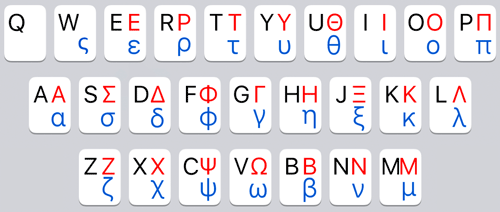

# *FinalD / 终点 🏁*
*2024年12月16日*

📣️**公告**：5.x版现已推出，增加“兼容模式”，具体见[兼容模式](#兼容模式)或[更新日志](joy/ChangeLog.md)。

[FinalD_un.ahk](Win/FinalD_un.ahk) 通用版：v5.45.100 (*2024/12/16*) \
[FinalD_rm.ahk](Win/FinalD_rm.ahk) Rime定制版：v5.45.98 (*2024/12/16*) \
*（运行程序后用快捷键左<kbd>Win</kbd>+<kbd>Alt</kbd>+<kbd>i</kbd>查看版本信息。）*

ℹ*提示：可通过此文档右上角的〔标题列表〕按钮快速转到某个标题。可通过后面有‘⚡️’图标的标题内容快速了解此项目，以及留意各部分的**粗体字**内容。*

## 项目缘起⚡️
如果你是一个程序员，那么很可能和我有相同的遭遇，就是用着一个号称中英混输的输入法，却还是经常须要切换中/英输入模式。为啥？为了输入标点符号。而且经常因为忘记切换，导致按对按键却输错标点符号而要按<kbd>Backspace</kbd>键来改错，非常无语。

这个输入法插件（以下简称此插件）的初衷就是要走完这最后的一公里，希望通过上下文来智能输入中/英标点符号，达到无需切换中/英输入模式即可输入和快速变换中/英标点符号的目的，==**把所有中文输入法带进真正意义上的中英混输新纪元**==。

✔谁需要这个输入法插件（忽悠对象）：
* 经常**需要中英混输**又想早睡的程序员；
* 经常**需要输入键盘上没有键位的中/英标点符号**的科研人员，或者是写学术论文的师生，例如：℃、π、≌、『』、²、⌘等；
* 喜欢**用Markdown写作和做笔记**的社会精英。

❌谁不需要这个输入法插件：
* 不需要用电脑的人；
* 只用电脑做简单文书工作的人。

## 主要功能⚡️
在说明此插件的功能之前，得先上一张设计方案图，有了它再来忽悠就容易多了。

呃……事情没有你想象的那么复杂，你听我狡辩。这张图看似复杂，但看完下面的说明，你就会觉得它很简单。
* 基础功能是**输入标点符号时根据前一个字符是中文或是英文（包括数字）来上屏相应的标点符号，并且成对的标点符号在特定情况下会自动配对**，如上图第一列和第二列所示，主打简单粗暴式智能。但这样难免有时会上屏并非期望的中/英标点符号啊，嗯，接下来便是见证奇迹的时刻。
* 上图第三列“英/中标点变换”的意思是当光标在标点符号后面时，**按左<kbd>Shift</kbd>键会将光标前的标点符号在`↔`号两边的常用中/英标点间来回变换**。另外，当光标在成对的标点符号中间时，此功能键还可以快速变换成对的标点符号。例如：成对的`""`和`“”`互相变换,英文`[]`和中文`【】`互相变换，等。如果光标不在成对的标点中间，也可以单独替换光标前的标点符号。 \
左<kbd>Shift</kbd>键还有一个功能，就是当光标前的标点是`←`号右边的扩展标点符号时，按此功能键可快速变换为`←`左边的常用标点。
* 上图第四列“扩展标点变换”的意思是当光标在标点符号后面时，**按右<kbd>Shift</kbd>键可将`→`左边所列的常用中/英标点快速变换为`→`右边的扩展标点符号**。另外，当光标在成对的标点符号中间时，此功能键同样可以自动变换成对的标点符号。右<kbd>Shift</kbd>键还有一个区别于左<kbd>Shift</kbd>键的功能，就是在对`'`或`"`变换时，只对光标前的标点进行单个变换，而不会对成对的`''`或`""`进行变换，在某些情况下会用到。
* 使用此输入法插件可以让大多数会自动配对和不会自动配对标点符号的编辑软件都有**一致的自动配对标点符号输入体验**。
* **数字后输入‘.’、‘:’、‘~’默认为英文标点**。数字后想输入中文句号，只需要在输入小数点后按一下左<kbd>Shift</kbd>键。另外，一般的中文输入法在你想输入6.5而不小心输入了67时，当你按<kbd>Backspace</kbd>键后再按<kbd>.</kbd>键想上屏小数点，却一般会上屏中文‘。’号。也就是说你得再删除一个没有输错的数字，再输一遍才行，是不是很不爽？此插件无论任何时候，只要光标前面是数字，按<kbd>.</kbd>键默认上屏小数点。
* 为Markdown写作做了考虑与优化。

此项目除了有一个适用于大多数中文输入法的un通用版之外，还有一个和Rime输入法深度整合的**rime定制版**，它借助Rime输入法输入标点符号时可以弹出候选框的功能来对右<kbd>Shift</kbd>键功能进行增强，**可以不按顺序变换想要输入的符号**。Rime输入法还可以快速输入[许多特殊符号](https://github.com/Lantaio/Rime-schema-JoySchema/blob/main/joy.symbols.yaml)。但由于是深度整合，所以须要和我的另一个开源项目配合使用。或者根据你的Rime输入方案对此程序稍作修改才可以配合使用。

肿么样，看完上面复杂的解释，再来看这张设计图，是不是很简单？😜

## 扩展功能⚡️
### 全键盘漂移
此插件从2.x版开始加入英文字母和数字的漂移功能。当光标在大、小写英文字母后面时，按左<kbd>Shift</kbd>键可以将光标前面的英文字母变换为相应的大、小写希腊字母。反之，当光标在大、小写希腊字母后面时，按右<kbd>Shift</kbd>键可以将光标前的希腊字母变换为相应的大、小写英文字母。英文字母和希腊字母的对应关系见下图（黑色为英文字母，红色为大写希腊字母，蓝色为小写希腊字母）：

另外，当光标在数字0~9后面时，按左<kbd>Shift</kbd>键可以变换为相应的大、小写希腊数字和空心数字序号，按右<kbd>Shift</kbd>键则会变换为相应的上、下标数字和实心数字序号，下图以数字2为例：

⚠因为英文字母和数字的漂移功能不常用，为免在输入时误按<kbd>Shift</kbd>键导致意外变换光标前的字符，**扩展功能默认关闭**，可通过快捷键左<kbd>Shift</kbd>+左<kbd>Win</kbd>开/关此功能。

### 中文语境软件优化
比方便快捷地变换标点符号更爽的是什么？是一击即中！换言之就是力求让此插件“懂”你想输入什么标点符号。以前此插件在全部应用程序上的体验都是一致的，例如：在英文之后输入标点符号会上屏英文标点。在编程软件中这样处理是合适的。但当我们用QQ或者微信撩妹的时候，可能多数时候希望输入的是中文的标点符号。因此从4.x版开始引入“中文语境应用程序组”概念，你可以将以中文输入为主的应用程序加入此程序组中。

在此插件的源代码开头的`GroupAdd "CN"`部分，有些预设项，可按需删除或临时注释掉不想以中文标点为主的预设项，也可以添加你希望以中文标点为主的应用程序。采用正则表达式写法，你还可以参考[帮助文档](https://wyagd001.github.io/v2/docs/lib/GroupAdd.htm)。

此功能默认开启，可以通过快捷键右<kbd>Shift</kbd>+左<kbd>Win</kbd>开/关此功能。如果不想默认打开此功能，可将此插件源代码开头处的`global BetterCN := true`修改为`false`即可。

### 兼容模式
在v5.x版之前此插件不能在各种软件的表格中使用，在表格中输入之前须要按快捷键左<kbd>Ctrl</kbd>+左<kbd>Win</kbd>停用此插件。

从v5.x版开始加入兼容模式功能，并将快捷键左<kbd>Ctrl</kbd>+左<kbd>Win</kbd>改为开/关此兼容模式。此模式其实是关闭了智能中/英标点输入和自动配对功能，保留用<kbd>Shift</kbd>键变换标点功能，使得切换到该模式时，在各种软件的表格中可以正常输入和变换标点。

## 安装需求
* 由于此插件是基于AutoHotkey这个开源软件而编写的脚本程序，而它只支持Windows系统，所以**此插件暂时只能在Windows系统使用**。
* AutoHotkey这个神器占用磁盘空间不足10MB,而且在你不运行脚本的时候不会运行占用内存。此插件运行时只占用2MB左右内存，而且CPU占用率极低，长期为0%。此插件只会在运行时接管所有标点符号按键事件，并且可以随时运行、暂停或关闭，**不会对你所用的输入法和电脑系统有任何改动**。

## 安装步骤⚡️
1. **安装依赖软件**：如果未安装AutoHotkey，先去[下载](https://www.autohotkey.com/)并安装（必须安装2.0或更新的版本）。

2. **下载程序文件**：此项目只有1个开源的脚本程序文件（以下简称此程序），存放在此项目的Win目录中。 \
[FinalD_un.ahk](Win/FinalD_un.ahk) 是通用版，理论上可用于所有中文输入法。（提示：Rime输入法也适用哦。） \
[FinalD_rm.ahk](Win/FinalD_rm.ahk) 是Rime输入法定制版，须要结合我的另一个开源项目[惊喜输入方案](https://github.com/Lantaio/Rime-schema-JoySchema)来使用。 \
将你要使用的程序文件下载到电脑的任意位置。

3. **此插件需要识别你所用的输入法**：rime版已设置好，直接做第5步。通用版已设置识别下面列出的输入法：
	* 搜狗拼音、五笔输入法
	* 微软拼音、五笔输入法
	* QQ拼音、五笔输入法
	* Rime输入法

	如果你用的输入法在上面的列表中，无需做第4步，直接做第5步。

4. 如果你所用的输入法不在第3步的列表中，可以**通过『Window Spy』获取输入法的`ahk_class`值**，步骤如下：
	1. 在『文件资源管理器』中点击（或双击）FinalD_un.ahk 运行它。
	2. 然后在电脑屏幕右下角任务栏处会有个绿色的H图标，鼠标右键点击此图标，在右键菜单中点击「Window Spy」打开『Window Spy for AHKv2』窗口。
	3. 再次用鼠标右键点击任务栏绿色H图标，在右键菜单中点击「Edit script」编辑此程序。
	4. 按`x`键，待出现输入法候选框之后，鼠标移动到输入法候选框上，然后查看在4.ⅱ步骤打开的『Window Spy』窗口，找到并复制第2行“ahk_class ...”的内容。
	5. 在此插件的源代码开头的`GroupAdd "IME"`部分，用上一步复制的“ahk_class ...”添加一行`GroupAdd "IME" "ahk_class ..."`，保存程序并关闭编辑器。
	6. 最后，用鼠标右键点击电脑右下角的绿色H图标，在右键菜单中点击「Exit」。

5. 须要在输入法设置中**禁用通过<kbd>Shift</kbd>键切换中/英输入模式**，建议设置为“无”，这样还是可以通过<kbd>Ctrl</kbd>+<kbd>Space</kbd>来切换中/英输入模式的。或改用<kbd>Ctrl</kbd>键。

6. 点击（或双击）**运行 FinalD_un.ahk（或 FinalD_rm.ahk）脚本程序**。🎉🎉🎉乌拉!🚀️🚀️🚀️感受火箭升空般的推背感吧！😎

### 快捷键列表
（⚠*必须按照先后顺序按下快捷键*）

| 快捷键                              | 功能                                   |
| ----------------------------------- | -------------------------------------- |
| 左<kbd>Ctrl</kbd>+左<kbd>Win</kbd>  | 开/关 （表格）[兼容模式](#兼容模式)（即 关/开 智能中/英标点输入和自动配对功能） |
| 左<kbd>Shift</kbd>+左<kbd>Win</kbd> | 开/关 [全键盘漂移功能](#全键盘漂移)（包括字母和数字） |
| 右<kbd>Shift</kbd>+左<kbd>Win</kbd> | 开/关 [中文语境软件优化功能](#中文语境软件优化) |
| 左<kbd>Win</kbd>+<kbd>Alt</kbd>+<kbd>h</kbd> | 运行/暂停 此程序 |
| 左<kbd>Win</kbd>+<kbd>Alt</kbd>+<kbd>i</kbd> | 显示此程序的版本信息                 |

## 已知问题⚡️
* 暂时只支持Win系统，**不支持Mac和Linux**。
* ⚠**在输入密码时可能会有问题，导致输入的密码不正确**！暂时无法解决，只能在输入密码之前通过快捷键左<kbd>Win</kbd>+<kbd>Alt</kbd>+<kbd>h</kbd>停用此插件。
* ⚠**不支持CMD命令提示符**，但支持PowerShell。（此程序已自动识别，使用CMD时无须停用此插件。）
* ⚠**在Excel中不能使用智能标点输入和自动配对功能**,但支持Excel的VBA编辑器。编辑空白单元格时须要用鼠标3连击此单元格，编辑有内容的单元格时须要用鼠标双击此单元格。（此程序已自动识别，使用Excel时无须手动打开（表格）[兼容模式](#兼容模式)。）
* ⚠**在各种软件的表格中不能使用智能中/英标点输入和自动配对功能**，因问题比较复杂，暂时无法解决，只能通过快捷键左<kbd>Ctrl</kbd>+左<kbd>Win</kbd>开启（表格）[兼容模式](#兼容模式)。
* ⚠在使用此插件的过程中可能**偶然会出现输入不正常的情况**（不单止是输入标点符号），这是由于AutoHotkey还不是很稳定，有时没有正确弹起<kbd>Shift</kbd>键导致的。解决办法是分别按一下左/右<kbd>Shift</kbd>键，应该就可以恢复正常了。如果还是有问题，则尝试退出此程序然后再次运行。这个问题只能看AutoHotkey的新版能否改善了。
* 在Word和PowerPoint中，输入英文单、双引号会自动变换为中文单、双引号。这个问题不是此插件造成的，是Office画蛇添足的骚操作，有[解决办法](https://github.com/Lantaio/IME-booster-FinalD/issues/4)。
* 个别需要按<kbd>Shift</kbd>键上屏的标点不能通过一直按着<kbd>Shift</kbd>键来重复发送，但你可以尝试一下，大部分常见的需要重复发送的标点符号都是可以正常连按的。
* 不能在选择了内容的情况下输入标点符号，会出现非预期的结果。但在Obsidian和Sublime Text中编辑Markdown时，可以选择内容后按<kbd>\*</kbd>键或<kbd>\`</kbd>键等来设置格式。
* 输入标点符号时由于是通过选择光标前、后字符来决定上屏哪个标点，因此可能会出现短暂闪动，Word等反应慢的程序会比较明显，但我觉得相比起所实现的功能来说，这种不适可以接受。暂时无法解决，如果你对这种闪动感到严重不适，只能弃用此插件。

## 后续操作
* 不要忘了还有**更强大的Rime定制版**哦，有兴趣的话请转到我的[惊喜输入方案](https://github.com/Lantaio/Rime-schema-JoySchema)瞧瞧。
* 如果你想将此插件**添加为开机启动项**，可以到AI网站[Kimi](https://kimi.moonshot.cn/)向它提问：“如何将AutoHotkey脚本添加为开机启动项？”
* 如果在某些情况下你需要**临时停用此插件**的话，无须关闭此插件，只需按快捷键左<kbd>Win</kbd>+<kbd>Alt</kbd>+<kbd>h</kbd>即可。留意任务栏绿色H图标会有变化。当你想恢复使用此插件时再次按此快捷键即可。（注意：用鼠标右键点击任务栏的H图标，再点击右键菜单中的「Pause Script」没有用！应选择「Suspend Hotkeys」）
* 此脚本程序只是一个样板，你完全可以按你的想法来改造这个脚本程序，使其真正成为你码字的🚀推进器。在最后的『[致谢](#致谢)』中有AutoHotkey中文帮助链接地址。
* 此说明文档开头有此插件的最新版本信息。如果比你在用的版本更新，只需下载新的脚本程序文件，直接覆盖旧文件，并用鼠标右键点击任务栏的H图标，再点击右键菜单中的「Reload Script」即可。\
⚠**警告：如果你自己修改过则不能直接覆盖，否则会丢失你的代码**！如想保留你的自定制设置，可以查看[更新日志](joy/ChangeLog.md)将更改合并到你的代码中。

## 欢迎反馈
* 如果你在使用此插件的过程中发现有什么问题、缺陷或功能需求，请在[议题（Issues）](https://github.com/Lantaio/IME-booster-FinalD/issues)中反馈情况。
* 如果有任何疑问或建议可在[讨论区（Discussions）](https://github.com/Lantaio/IME-booster-FinalD/discussions)中提出。

## 卸载步骤
如果你不喜欢使用此插件，可以通过下面几个简单的步骤来删除它：
1. 用鼠标右键点击电脑右下角任务栏的绿色H图标，在右键菜单中点击「Exit」关闭此插件。
2. 打开系统的『文件资源管理器』，找到并删除 FinalD_un.ahk 或 FinalD_rm.ahk 文件。
3. 打开系统的『控制面板』→『程序和功能』，卸载AutoHotkey程序。

## 版权许可
注意，此项目是一个**保留版权（Copyright©）项目**，*不是*一个自由（Copyleft）项目。此版权授权你在非售卖的情况下可对此项目进行任意修改，以使其更适合你的使用习惯。但如果你将此插件（包括你对其进行修改的版本）用于销售目的，则须要向我支付费用购买许可证。如果你对此项目进行了修改，则必须明确指出修改之处，或者修改相应的署名，不能让别人误认为是我的作品。

## 收费规则
### 免费情形
* 可以免费将此插件用于个人用途以及在非营利性组织中使用。
* 可以将此插件（或其修改版）以开源的方式包含在你的开源项目中而无需给我付费，即便你的开源项目是收费项目。
* 如果你在GitHub上给[此项目](https://github.com/Lantaio/IME-booster-FinalD)星标⭐，并且是排名前100万名的标星用户，则可以免费获得1个许可证，以感谢你对此项目的认可与支持🤝
* 如果你将此插件介绍给没有听说过此插件的亲朋好友，则每推荐给1位朋友可以减免￥1元费用，上不封顶（可用于抵扣多个许可证的费用）。我敢肯定，你从来没有参与过这么有意义并且真正可以省钱的传销活动😁
* 如果你对我的项目提出有建设性的建议💡并被我采纳的话，可以免费获得1个许可证。

### 收费情形
如果你将此插件（包括你对其进行修改的版本）用于能获取报酬的工作或者商业售卖，则需要在**3个月免费试用期**后向我支付费用购买使用许可证。每个系统（包括虚拟机系统）需要1个许可证。暂定为每个许可证收取人民币￥2元，即可获得此项目的永久使用权，并可免费获得所有后续更新的使用权。现阶段我会从每笔收款中拿出￥1元给开发AutoHotkey这个神器的大神，另外拿出￥0.5元给AutoHotkey帮助文档的中文翻译大神。

ℹ*提示：此收费不包括任何软件功能及其稳定性方面的承诺或保证，现阶段也无法提供技术支持服务。*

付款请备注“终点插件”，以便我转款给开发AutoHotkey的大神，谢谢。

## 打赏支持
除了商业用途需要购买许可证之外，如果你觉得此插件很赞，令你的输入速度火箭般爆发，让你兴奋得冲昏了头脑，也可以通过上面的二维码给我打赏支持，金额随喜。同样请备注“终点插件”，我也会按『[收费情形](#收费情形)』中所说的比例转账给相关的大神。多谢支持与鼓励😊

ℹ*提示：为保护赞助人的隐私，本人不会制作『打赏支持感谢名单』。另外，无论是付款购买许可证还是打赏支持，都不应视为期望我为你实现特定功能而给我预先支付报酬。此插件的功能仅以现状提供。*

## 致谢💐
首先要感谢出品[AutoHotkey](https://github.com/AutoHotkey/AutoHotkey)这个神器的大神 [Lexikos](https://github.com/Lexikos) 以及项目的其他贡献者们奉献这么强大的脚本编程软件。🌹

其次要感谢[AutoHotkey中文帮助](https://wyagd001.github.io/v2/docs/index.htm)的翻译及维护大神 [wyagd001](https://github.com/wyagd001)，大大提高了我学习AutoHotkey的效率。🌹

最后感谢那个在开发这个看似简单，实则有许多呕血的坑的项目时数度被暴击到崩溃，却总是不言放弃，一次次爬起来直面困难的自己😅还有在这些痛并快乐的日子里一直陪伴着我的小猪咪🐈
