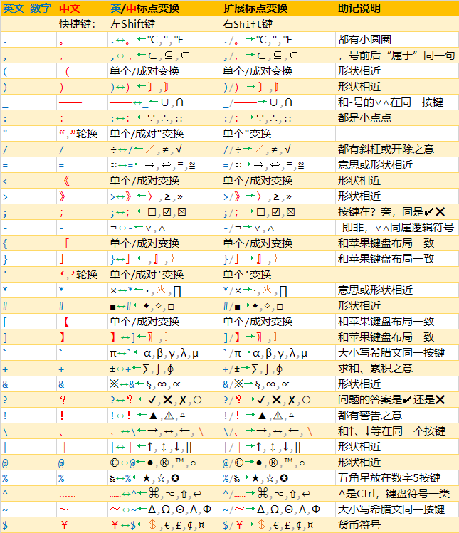

# *FinalD / 终点 🏁*
*2024年6月12日*

**📣️告示：此项目的设计理念将有重大变动，同时将解决近期遇到的一些大问题。正在努力开发，6月中将推出1.x版，敬请留意。**

[FinalD_un.ahk](Win/FinalD_un.ahk) 通用版：v0.26.54 (*2024/6/6*) \
[FinalD_rime.ahk](Win/FinalD_rime.ahk) Rime定制版：v0.27.54 (*2024/6/6*) \
*用<kbd>Shift</kbd>+左<kbd>Win</kbd>快捷键组合查看版本信息。[更新日志](joy/ChangeLog.md)*

*提示：可通过此文档右上角的〔标题列表〕按钮快速转到某个标题。可以通过后面有‘⚡️’图标的标题内容快速了解此项目，以及留意各部分的**粗体字**内容。*

## 项目概述⚡️
啥？标点符号也玩漂移？对，此中文输入法插件（以下简称此插件）是中/英文标点符号快速输入程序，**通过更懂你心意和更方便地输入中/英文标点符号来提高输入速度**，给你的输入法装上火箭推进器。

谁需要这个输入法插件（忽悠对象）：
* 经常**需要中英混输**又想早睡的程序员；
* 经常**需要输入键盘上没有键位的中/英文标点符号**的科研人员，或者是写学术论文的师生，例如：℃、π、≅、『』、【】、〔〕等；
* 喜欢**用Markdown写技术文档或者做笔记**的社会精英。

谁不需要这个输入法插件：
* 不需要用电脑的人；
* 只用电脑做简单文书工作的人。

## 项目缘起
如果你是一个程序员，那么很可能和我有同样的遭遇，就是用着一个号称是中英混输的中文输入法，却依然需要经常按<kbd>Shift</kbd>键切换中/英文输入模式。而且很有可能是当你发现输错了内容，需要按<kbd>Backspace</kbd>键之后，再去切换中/英输入模式。这算哪门子中英混输啊？
为什么会这样？问题出在哪里？标点符号，对，问题就出在标点符号。那些号称中英混输的输入法只实现了中/英文单词的混输，却没有做到中/英文标点符号的混输。
这个插件的目标就是要走完这最后的一公里，让标点符号都实现中英混输，==**将所有中文输入法带进一个无需切换中/英输入模式的新纪元**==。

## 方案设计
在说明此插件的功能之前，得先上一张设计方案图，有了它再来忽悠就容易多了。

呃...事情不是你想象的那么复杂，你听我狡辩。这张图看似复杂，但看完下面的解析，你就会觉得它很简单。
1. 先说我的主要思路，要是可以按标点键的时候根据前一个字符是英文还是中文来上屏期望的标点符号，它不香吗？这便是上图第1列和第2列所列标点的意思。你看，很简单嘛。写代码的时候一般都是英文，其中的标点符号自然也是英文。中文写作的时候标点符号又多数是中文，简单粗暴也可以出奇迹嘀。但不是说前一个字符是中文，就一律上屏中文标点，个别相对低频的中文标点符号会让位于对应的高频英文标点，例如：无论前一个字符是中文还是英文，按<kbd>\[</kbd>键都是上屏英文‘\[’号，而不是在中文时上屏中文的‘【’号。你可能会说这样一来会导致不统一，二来我要是想输入‘【’号怎么办？而我则认为对一个输入法而言，**速度是首要的考虑因素**，爽才是最重要的。所以我倒是将标点符号的输入频率作为最重要的考虑因素。用下来你就会明白，频率高代表命中率高。至于第二个问题，就由第2个功能设计来解决。
2. 可能有些看官已经想到了，第1个功能虽然可以应付大部分情况，但现实哪有这么简单。比如说有些时候我们在中文里夹杂着English，刚好后面要输入标点符号，那出来个英文标点不对呀。又比如说有时一句话刚好以数字结束8。那按照第1个功能它出来个小数点也不是我期望的啊，这不还得按<kbd>Backspace</kbd>键吗？ \
但你有没有想过，按<kbd>Backspace</kbd>键，然后再按<kbd>Shift</kbd>键切换中/英输入模式，再接着干什么？其实还是按刚才那个标点键啊！也就是说其实我们没有按错键，只是电脑上屏了不是我们期望的标点符号而已。有没有更好的方法，不是我们去做这些既无聊又累人的改正工作，而是由电脑去做？我看行，这便是上图第3列要做的事情，用左<kbd>Shift</kbd>键来告诉电脑：“你搞错了，给我改过来。” \
以前面的2个情况为例，输入“English”之后按<kbd>,</kbd>键，按照1的功能设计，会上屏一个英文‘,’号。这时只需要按一下左<kbd>Shift</kbd>键，它便可以将光标前面的英文逗号变换为中文‘，’号。在输入阿拉伯数字之后如果按<kbd>.</kbd>键，默认会上屏小数点。而如果你想输入的是中文句号的话，只需要按1下左<kbd>Shift</kbd>键来将光标前的小数点快速变换为中文‘。’号。并且这种变换不是单向的，是中/英循环的。
3. 本来在1和2功能的加持下，输入标点符号已经很爽了，已经可以和那个辣鸡中/英输入模式切换功能说bye-bye了。但可能会有老学究跳出来说：“Too young! Too simple! 中华文化博大精深，就这两把刷子，连基本的中文标点符号都弄不齐全，我要是个编字典的还不是一样累死。”想想也是……哎，这不还有一个右<kbd>Shift</kbd>键吗？就用它来做上图第4列『常见标点轮换』的功能键，每按1次就按次序变换到下一个标点符号。这回不单止可以包括所有常用的中文标点符号，甚至还可以安排一些常用的数学符号或者特殊符号咯。
4. 老学究还要找茬，说每按1次右<kbd>Shift</kbd>键才变换1个符号，那我想输入排在后面的标点符号的话，还是得按好几次啊。真是得寸进尺，这样吧，如果你觉得这样还不够爽，那我忽悠你用Rime输入法，因为它在输入标点符号的时候可以像输入字词一样弹出候选框，就像上图的第5列（还可以很方便地自定制），直接选择你想要输入的标点符号就可以马上上屏那个标点了。
5. 最后补充一下，如果你和我一样，经常在做梦的时候和地外文明有接触，地球上所有的标点符号都得用上的话（What the @#$×%），那么Rime输入法还是可以满足你对速度与激情的追求嘀，可以瞧瞧[这个表](https://github.com/Lantaio/Rime-schema-JoySchema/blob/main/joy.symbols.yaml)。

肿么样，看完上面复杂的解析，再来看这张设计图，是不是很简单？

## 主要功能⚡️
* **输入标点符号时根据前一个字符是中文或是英文（包括数字）来上屏相应的标点符号，并且成对的标点符号在特定情况下会自动配对**，主打智能和一个爽字。
* 当光标在标点符号后面时，**按左<kbd>Shift</kbd>键会将光标前的标点符号作英/中*高频标点*变换**(如[设计方案图](#方案设计)中第3列『英/中标点变换』所示)。另外，当光标在成对的标点符号中间时，此功能键还可以快速变换成对的标点符号。例如：成对的`""`和`“”`互相变换,英文`[]`和中文`【】`互相变换等。如果光标不在成对的标点中间，也可以单独替换光标前的标点符号。
* 当光标在标点符号后面时，**按右<kbd>Shift</kbd>键可轮换常用的中英文标点符号**(如[设计方案图](#方案设计)中第4列『常见标点轮换』所示）。另外，当光标在成对的标点符号中间时，此功能键同样可以自动变换成对的标点符号。右<kbd>Shift</kbd>键还有一个区别于左<kbd>Shift</kbd>键的功能，就是在对`'`和`"`的变换时，只对光标前的标点进行单个变换，而不会对成对的`''`和`""`进行变换，此功能在某些场景下非常有用。
* 使用此输入法插件可以让大多数会自动配对和不会自动配对标点符号的编辑软件都有**统一的自动配对标点符号输入体验**。
* **数字后输入任何标点默认为英文标点**。数字后想输入中文句号，只需要在输入小数点后按1下左（或右）<kbd>Shift</kbd>键。另外，一般的中文输入法在你想输入6.5而不小心输入了65时，当你按<kbd>Backspace</kbd>键后再按<kbd>.</kbd>键想上屏小数点，却一般会上屏中文‘。’号。也就是说你得再删除一个没有输错的数字，再输一遍才行，是不是很不爽？此插件无论任何时候，只要光标前面是数字，按<kbd>.</kbd>键默认上屏小数点。
* **为Markdown写作做了充分的考虑与优化**。
* 此项目除了有一个适用于大多数中文输入法的un通用版之外，还有一个和Rime输入法深度整合的**更强大的rime版**，它借助Rime输入法输入标点符号时可以弹出候选框的功能来对右<kbd>Shift</kbd>键功能进行增强，**可以更快地变换想要输入的符号**。Rime输入法还可以快速输入[许多特殊符号](https://github.com/Lantaio/Rime-schema-JoySchema/blob/main/joy.symbols.yaml)。但由于是深度整合，所以须要和我的另一个开源项目配合使用。或者根据你的Rime输入方案对此程序稍作修改才可以配合使用。

## 安装需求
* 由于此插件是基于AutoHotkey这个开源软件而编写的脚本程序，而它只支持Windows系统，所以**此插件暂时只能在Windows系统使用**。
* AutoHotkey这个神器占用磁盘空间不足10MB,而且在你不运行脚本的时候不会运行占用内存。此插件运行时只占用2MB左右内存，而且CPU占用率极低，长期为0%。此插件只会在运行时接管所有标点符号按键事件，并且可以随时运行、暂停和关闭，**不会对你所用的输入法和电脑系统有任何改动**。

## 安装步骤⚡️
1. **安装依赖软件**：如果未安装AutoHotkey，先去[下载](https://www.autohotkey.com/)并安装（必须安装2.0或更新的版本）。
2. **下载程序文件**：此项目只有1个开源的脚本程序文件，存放在此项目的Win目录中。 \
[FinalD_un.ahk](Win/FinalD_un.ahk) 是通用版，理论上可用于所有中文输入法。（提示：Rime输入法也可以用哦。首次运行可能需要做点小修改，后面第3点会讲到。） \
[FinalD_rime.ahk](Win/FinalD_rime.ahk) 是Rime输入法定制版，须要结合我的另一个开源项目[惊喜输入方案](https://github.com/Lantaio/Rime-schema-JoySchema)来使用。 \
将你想使用的文件下载到你的电脑的任意位置。
3. **修改 FinalD_un.ahk，让插件识别你所用的输入法**(un版默认设置为搜狗拼音输入法，如果你用的是搜狗拼音输入法，无需此步骤，直接做第5步。rime版已设置好，无需此步骤，直接做第5步。）：
	1. 在『文件资源管理器』中鼠标右键点击 FinalD_un.ahk 文件，在右键菜单中点击「Edit script」编辑此脚本文件。
	2. 搜索`SoPY_Comp`（大概在第213行），下面几行注释列出了几种常用的输入法的`ahk_class`值。如果你用的输入法在其中，就用它的值替换第213行中的“`SoPY_Comp`”。
	3. 保存文件并关闭编辑器。（**注意：须要保存为UTF-8编码格式**！如果不懂直接保存可能行）
	4. 做下面第5步。
4. 如果你所用的输入法在第3步的注释中没有列出来，可以**通过『Window Spy』获取输入法的`ahk_class`值**，步骤如下：
	1. 在『文件资源管理器』中点击（或双击）FinalD_un.ahk 文件运行它。
	2. 运行插件后在电脑右下角任务栏处会有个绿色的H图标，鼠标右键点击此图标，在右键菜单中点击「Window Spy」打开『Window Spy for AHKv2』窗口。
	3. 在『文件资源管理器』中鼠标右键点击 FinalD_un.ahk 文件，在右键菜单中点击「Edit script」编辑此脚本文件。
	4. 搜索`SoPY_Comp`（大概在第213行），先任意输入一些拼音，待出现输入法候选框之后，鼠标移动到输入法候选框上，然后查看在4.2步骤打开的『Window Spy』窗口，找到并复制第2行“ahk_class ...”的内容。
	5. 用上一步复制的“ahk_class ...”替换第213行中的`ahk_class SoPY_Comp`，然后保存并关闭编辑器。
	6. 最后，用鼠标右键点击电脑右下角的绿色H图标，在右键菜单中点击「Exit」。
5. 须要在输入法设置中**禁用通过<kbd>Shift</kbd>键切换中/英文输入模式**，建议改用<kbd>Ctrl</kbd>键。
6. 点击（或双击）**运行 FinalD_un.ahk（或 FinalD_rime.ahk）脚本程序**。🎉🎉🎉乌拉!🚀️🚀️🚀️感受火箭升空般的推背感吧！😎

## 已知问题⚡️
* 暂时只支持Win系统，**不支持Mac和Linux**。（听说这2个系统都有类似AutoHotkey的软件，日后有可能在这些系统实现此插件。）
* ⚠**不支持Excel**。（此插件程序已自动屏蔽，使用Excel时无须停用此插件。）
* ⚠**在Word的表格中也有问题**，因问题比较复杂，暂时无法解决。如果在Word的表格中经常遇到问题，只能通过左<kbd>Ctrl</kbd>+左<kbd>Win</kbd>快捷键组合来暂时停用此插件。
* **不支持CMD命令提示符**，但支持PowerShell。（此插件程序已自动屏蔽，使用CMD时无须停用此插件。）
* ⚠在使用此插件的过程中可能**偶然会出现输入不正常的情况**（不单止是输入标点符号），这是由于AutoHotkey还不是很稳定，有时没有正确弹起<kbd>Shift</kbd>键导致的。解决办法是分别按一下左/右<kbd>Shift</kbd>键，应该就可以恢复正常了。这个问题暂时无法解决，只能看AutoHotkey的新版能否改善了。
* ⚠**在文件管理器里用<kbd>Shift</kbd>键连续选择多个文件时有问题**，有临时[解决办法](https://github.com/Lantaio/IME-booster-FinalD/issues/7)
* ⚠如果是**用<kbd>Shift</kbd>键+鼠标滚轮来左右移动屏幕**的话，如果光标恰好在标点符号后面，也会导致标点符号发生改变。暂时也可以用上一个问题的解决办法来解决，或者干脆换用其它快捷键组合来作为触发功能的按键。
* 个别需要按<kbd>Shift</kbd>键上屏的标点不能通过一直按着<kbd>Shift</kbd>键来重复发送，但你可以尝试一下，大部分常见的需要重复发送的标点符号都是可以正常连按的。
* 不能在选择了内容的情况下输入标点符号，会出现非预期的结果。但在Obsidian和Sublime Text中编辑Markdown时，可以选择内容后按<kbd>\*</kbd>键或<kbd>`</kbd>键等来设置格式。
* 输入标点符号时由于是通过选择光标前、后字符来决定上屏哪个标点，因此可能会出现短暂闪动，Word等反应慢的程序会比较明显，但我所用的代码编辑器都不明显。暂时无法解决。如果你对这种闪动感到严重不适，只能放弃使用此插件。
* 段落开头第1个字符是标点符号时统一上屏英文标点。
* 在Word和PowerPoint中，英文单、双引号会自动变换为中文单、双引号。这个问题不是此插件造成的，有[解决办法](https://github.com/Lantaio/IME-booster-FinalD/issues/4)。

## 后续操作
* 不要忘了还有**更强大的Rime定制版**哦，有兴趣的话请转到我的[惊喜输入方案](https://github.com/Lantaio/Rime-schema-JoySchema)瞧瞧。
* 如果你想将此插件**添加为开机启动项**，可以到AI网站[Kimi](https://kimi.moonshot.cn/)向它提问：“如何将AutoHotkey脚本添加为开机启动项？”
* 如果在某些情况下你需要**临时停用此插件**的话，无须关闭此插件，只需按左<kbd>Ctrl</kbd>+<kbd>Win</kbd>快捷键组合。留意任务栏绿色H图标会有变化。当你想恢复使用此插件时重复按此快捷键组合即可。（注意：用鼠标右键点击任务栏的H图标，再点击右键菜单中的「Pause Script」没有用！）
* 此脚本程序只是一个样板，你完全可以按你的想法来改造这个脚本程序，使其真正成为你码字的🚀推进器。在最后的『[致谢](#致谢)』中有AutoHotkey中文帮助链接地址。
* 此说明文档开头有此插件的最新版本信息。如果比你在用的版本更新，只需下载新的脚本程序文件，直接覆盖旧文件即可。**注意：如果你自己修改过则不能直接覆盖，否则会丢失你的代码**！如想保留你的自定制设置，可以查看[更新日志](joy/ChangeLog.md)将更改合并到你的代码中。

## 欢迎反馈
* 如果你在使用此插件的过程中发现有什么问题、缺陷或功能需求，请在[议题（Issues）](https://github.com/Lantaio/IME-booster-FinalD/issues)中反馈情况。
* 如果有任何疑问或建议可在[讨论区（Discussions）](https://github.com/Lantaio/IME-booster-FinalD/discussions)中提出。

## 卸载步骤
如果你不喜欢使用此插件，可以通过下面几个简单的步骤来删除它：
1. 用鼠标右键点击电脑右下角任务栏的绿色H图标，在右键菜单中点击「Exit」关闭此插件。
2. 打开系统的『文件资源管理器』，找到并删除 FinalD_un.ahk 或 FinalD_rime.ahk 文件。
3. 打开系统的『控制面板』→『程序和功能』，卸载AutoHotkey程序。

## 版权许可
注意，此项目是一个**保留版权（Copyright©）项目**，*不是*一个放弃版权（Copyleft）项目。此版权授权你在非售卖的情况下对此项目进行任意修改，以使其更适合你的使用习惯。但如果你将此插件（包括你对其进行修改的版本）用于销售目的，则须要向我支付费用购买许可证。如果你对此项目进行了修改，则必须明确指出修改之处，或者修改相应的署名，不能让别人误认为是我的作品。

## 收费规则
**你可以免费将此插件用于个人用途以及在非营利性组织中使用**。但如果你将此插件（包括你对其进行修改的版本）用于能获取报酬的工作或者商业售卖，则需要在**3个月免费试用期**后向我支付费用购买使用许可证。每个系统（包括虚拟机系统）需要1个许可证。暂定为每个许可证收取人民币￥2元，即可获得此项目的永久使用权，并可免费获得所有后续更新的使用权。我会从每笔款项中拿出￥1元给开发AutoHotkey这个神器的大神，另外拿出￥0.5元给AutoHotkey帮助文档的中文翻译大神。注意，**此收费不包括任何软件功能及其稳定性方面的承诺或保证，现阶段也无法提供技术支持服务**。

其它免除费用的情形：
* 如果你在GitHub上给[此项目](https://github.com/Lantaio/IME-booster-FinalD)星标⭐，并且是排名前100万名的标星用户，则可以免费获得1个许可证，以感谢你对此项目的认可与支持🤝
* 如果你将此插件介绍给*没有听说过*此插件的亲朋好友，则每推荐给1位朋友可以减免￥1元费用，上不封顶（可用于抵扣多个许可证的费用）并且可以转让！我敢肯定，你从来没有参加过这么有意义并且真正可以省钱的传销活动😁
* 如果你对我的项目提出有建设性的建议💡并被我采纳的话，也可以免费获得1个许可证。

付款请备注“终点插件”，以便我转款给开发AutoHotkey的大神，谢谢。

## 打赏支持
除了商业用途需要购买许可证之外，如果你觉得此插件很赞，令你的输入速度火箭般爆发，让你高兴得冲昏了头脑，也可以通过上面的二维码给我打赏支持，金额随喜。同样请备注“终点插件”，我也会按『[收费规则](#收费规则)』中所说的比例转账给开发AutoHotkey的大神。多谢支持与鼓励😊

*提示：为免导致攀比，本人不会制作『打赏支持感谢名单』。另外，无论是付款购买许可证还是打赏支持，都不应视为期望我为你实现特定功能而给我预先支付报酬。此插件的功能仅以现状提供。*

## 致谢
首先要感谢出品[AutoHotkey](https://github.com/AutoHotkey/AutoHotkey)这个神器的大神 [Lexikos](https://github.com/Lexikos) 以及项目的其他贡献者们奉献这么强大的脚本编程软件。🌹

其次要感谢[AutoHotkey中文帮助](https://wyagd001.github.io/v2/docs/index.htm)的翻译及维护大神 [wyagd001](https://github.com/wyagd001)，大大提高了我学习AutoHotkey的效率。🌹

最后感谢那个在开发这个看似简单，实则有许多呕血的坑的项目时数度被暴击到崩溃，却总是不言放弃，一次次爬起来直面困难的自己😅还有在这些苦闷的日子里一直陪伴着我的小猪咪🐈
